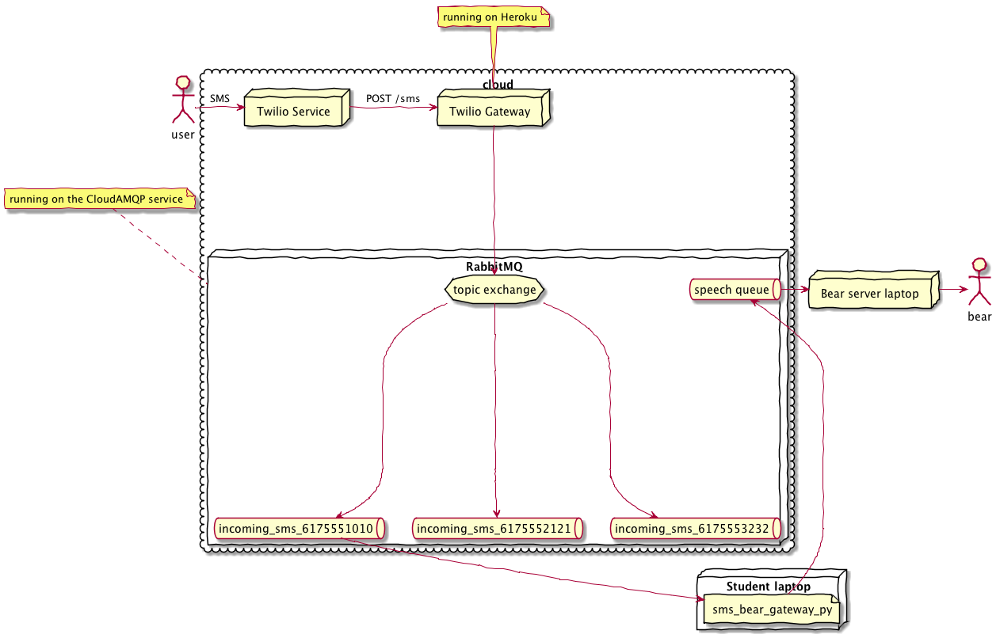

# Bear-as-a-Service

- A Holiday Happening
- [A Life Size Brown Cardboard Bear](https://www.amazon.com/Brown-Bear-Advanced-Graphics-Cardboard/dp/B00B03DT0O)
- Keenan Zucker
- Patrick Huston

## Quick Start (client only)

This requires a running Bear server, and a [Twilio ⟶ MQTT Gateway](https://github.com/olin-build/twilio-mqtt-gateway).

In class, you were given your Twilio phone number, and the credentials for
The Bear server and Twilio gateway.

1. Follow the Install instructions below.
2. Run `python3 examples/sms_bear_gateway.py`
3. Send a text message to your Twilio phone number.

## Install

Make sure you have a running Python 3.6. Earlier versions of Python 3.x might
work too, but haven't been tested. Python 2.x is Right Out.

### macOS and Linux

Copy `envrc.template` to `.envrc`. On Linux/macOS: `cp envrc.template .envrc`.

Replace the strings in `.envrc` by your Twilio and MQTT credentials and phone number.

Execute: `source .envrc`

Or, optionally install [direnv](https://direnv.net/). This will prevent you from having to manually `source .envrc` each time in the future.

Now continue to the "All Platforms" instructions.

### Windows

On Windows, set an environment variable from the command line using:

`setx MQTT_URL mqtt://…`

Repeat for each variable in `envrc.template`.

This adds entries to the Windows registry. You only need to do this once.

### All Platforms

`pip3 install -r requirements.txt`

Send a test message. (Replace the number below by your own phone number.)

`python3 scripts/send_sms_message.py +16175551010`

Send a test message to the bear:

`python3 mqtt_json/send_mqtt_message.py "forget about your worries"`

## Run the Server

Provision a RabbitMQ server. Or, use the same server as the Twilio ⟶ MQTT
Gateway.

`pip3 install -r requirements.txt` and create `.envrc`, as above.

On Linux and Windows, install [espeak](http://espeak.sourceforge.net).
On macOS, the server uses the built-in `say` command, which has better quality.

`python tts_worker.py`.

## Test

`pytest` runs the unit tests (currently just of the `mqtt_json` package).

`pytest-watch` runs the tests in watch mode.

`pytest --cov=. --cov-report html:coverage` generates a code coverage report.
Open `./coverage/index.html` to view it.

`flake8 .` lints the code.

`tox` runs the tests and linter in their own Python virtual environment.
This validates `requirements.txt`, and could be used to test the code in
multiple different Python versions.

## Architecture

The SMS ⟶ Bear gateway example depends on the [Twilio ⟶ MQTT Gateway](https://github.com/olin-build/twilio-mqtt-gateway).

Together with the Gateway, it looks like this:

## Acknowledgements

Bear-as-a-Service was adapted from Patrick Huston's Holiday Bear, introduced at
the Olin College December 2017 Holiday Party.

Jeff Goldenson came up with the “Bear as a Service” idea.

## LICENSE

MIT
